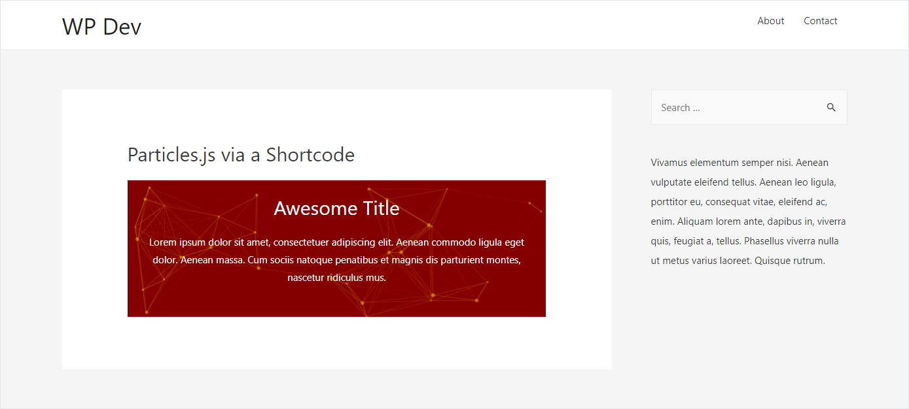

# Description

This is a WordPress plugin to add [particles.js](https://vincentgarreau.com/particles.js/) background to an HTML element. It can also add a particle.js section with content via a shortcode. The JSON config for particles.js can be customized.

The plugin is developed using [WordPress Plugin Boilerplate 3.0](https://github.com/DevinVinson/WordPress-Plugin-Boilerplate).

## Screenshots

